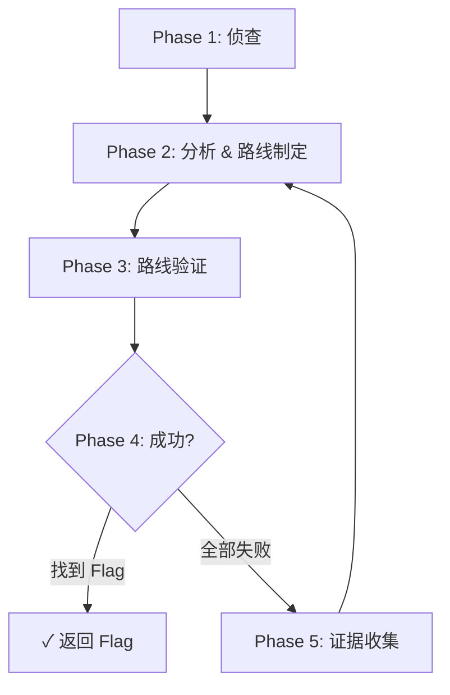

# Opencode for CTF

[English](./README_EN.md)

**opencode-for-ctf** 是一个面向 [OpenCode](https://opencode.ai) 的 CTF 自动化解题 Agent 插件。

它不是一个单一的 prompt，而是一套完整的插件式 Agent 工程方案，围绕 **agents / commands / skills / tools** 组织，为 CTF 解题提供结构化、可复用、可扩展的能力。

## 特性

- **两大主 Agent** — `ctf-fast`（轻量快速解题）和 `ctf-expert`（证据驱动全面分析）
- **全题型覆盖** — Web / Pwn / Rev / Crypto / Forensics / Misc
- **140+ 工具** — 文件分析、Web 探测、二进制调试、密码学计算、取证提取等
- **56+ 技能** — 各题型方法论沉淀为可复用的 skill
- **120+ 命令** — 统一入口，减少每次手工组织上下文
- **证据驱动** — `ctf-expert` 模式下通过 Evidence.md 追踪已知信息，迭代逼近 flag
- **插件化架构** — 作为 OpenCode 插件加载，无侵入

## 快速开始

### 作为插件安装

在 `~/.config/opencode/opencode.jsonc` 中添加插件引用：

```jsonc
{
  "plugin": ["file:C:\\path\\to\\Opencode-for-CTF"],
  "default_agent": "ctf-fast",  // 可选: ctf-fast 或 ctf-expert
  "skills": {
    "paths": [
      "C:\\path\\to\\Opencode-for-CTF\\skills",
      "C:\\path\\to\\Opencode-for-CTF\\skills-external\\ctf-skills"
    ]
  },
  "instructions": [
    "C:\\path\\to\\Opencode-for-CTF\\rules-cn.md",
    "C:\\path\\to\\Opencode-for-CTF\\ctf-rules.md"
  ]
}
```

### 安装依赖

```bash
npm install
```

## Agent 一览

| Agent | 类型 | 用途 |
|-------|------|------|
| `ctf-fast` | **主 agent** | 轻量快速解题 — 直觉优先、最小工具依赖、快速验证 |
| `ctf-expert` | **主 agent** | 全面证据驱动解题 — 侦查→分析→路线验证→迭代循环 |
| `ctf-web` | 子 agent | Web 漏洞利用 |
| `ctf-pwn` | 子 agent | 二进制漏洞利用 |
| `ctf-rev` | 子 agent | 逆向工程 |
| `ctf-crypto` | 子 agent | 密码学攻击 |
| `ctf-forensics` | 子 agent | 取证分析 |
| `ctf-scout` | 子 agent | 信息搜集 |
| `ctf-librarian` | 子 agent | 知识库查询 |
| `ctf-oracle` | 子 agent | 模式匹配/知识推断 |

### 选择指南

| 场景 | 推荐 agent |
|------|-----------|
| 快速尝试解题、简单题型 | `ctf-fast` |
| 已知常见套路、需要快速验证 | `ctf-fast` |
| 复杂逆向/二进制利用 | `ctf-expert` |
| 多步骤 Web 链式攻击 | `ctf-expert` |
| 不熟悉的题型、需要深入分析 | `ctf-expert` |
| 多次尝试仍未解出 | `ctf-expert` |

## 仓库结构

```
Opencode-for-CTF/
├── opencode.json           # 插件入口
├── package.json            # Node.js 依赖
├── agents/                 # Agent 定义 (YAML frontmatter + markdown)
├── commands/               # Slash 命令
├── skills/                 # CTF 技能库 (56+ skills)
├── skills-external/        # 外部 CTF 技能 (ctf-skills 镜像)
├── tools/                  # CTF 工具 (140+ tools)
├── templates/              # solve / exploit 模板
├── src/                    # 插件运行时
│   ├── plugin.ts           # 插件入口
│   ├── team-manager.ts     # 团队模式编排
│   └── continuation-manager.ts
├── scripts/                # 校验与诊断脚本
├── rules/                  # 安全/CTF 规则
├── knowledge/              # 知识库 (lessons, pattern-cards)
├── lessons/                # 结构化 lessons
├── packages/               # 子包 (ctf-core, ctf-notes-core 等)
└── runtime/                # 运行时环境辅助脚本
```

## 配置

### 工作区配置

参考 `CTF_WORKSPACE_OPENCODE_TEMPLATE.jsonc` 配置你的 CTF 工作区。

### 环境变量

| 变量 | 用途 |
|------|------|
| `DEEPSEEK_API_KEY` | DeepSeek API Key |
| `GITHUB_PAT` | GitHub Personal Access Token |
| `GHIDRA_INSTALL_DIR` | Ghidra 安装目录 |
| `JINA_API_KEY` | Jina AI API Key |
| `BRAVE_API_KEY` | Brave Search API Key |

## 使用方式

### 快速解题 (ctf-fast)

适合简单到中等难度的题目，直觉优先、快速验证：

```
/ctf-fast ./challenge
```

### 全面解题 (ctf-expert)

适合复杂题目，证据驱动、多轮迭代：

```
/ctf-expert ./challenge
```

### 专业子 agent

已知题型可直接调用对应子 agent：

```
/ctf-web http://127.0.0.1:8000
/ctf-pwn ./chall --remote 127.0.0.1:31337
/ctf-rev ./crackme
/ctf-crypto ./challenge.py
/ctf-forensics ./artifact.pcap
```

### ctf-expert 工作流

`ctf-expert` 采用五阶段循环解题：



- 每次制定 **3 条路线**，依次验证
- 维护 `Evidence.md` 追踪已知信息和已验证事实
- 受阻 ≠ 死路，WAF/障碍可能意味着方向正确
- 三条路线失败后收集证据，重新分析，迭代直到拿到 flag

## Agent 开发

本插件遵循 OpenCode Agent 规范。agent 定义采用 YAML frontmatter + markdown 格式：

```yaml
---
"description": "Agent 描述"
"mode": "primary"  # 或 subagent
"temperature": 0
"steps": 120
---
# Agent 指令内容
```

详情参考 [AGENTS.md](./AGENTS.md)。

## License

MIT
