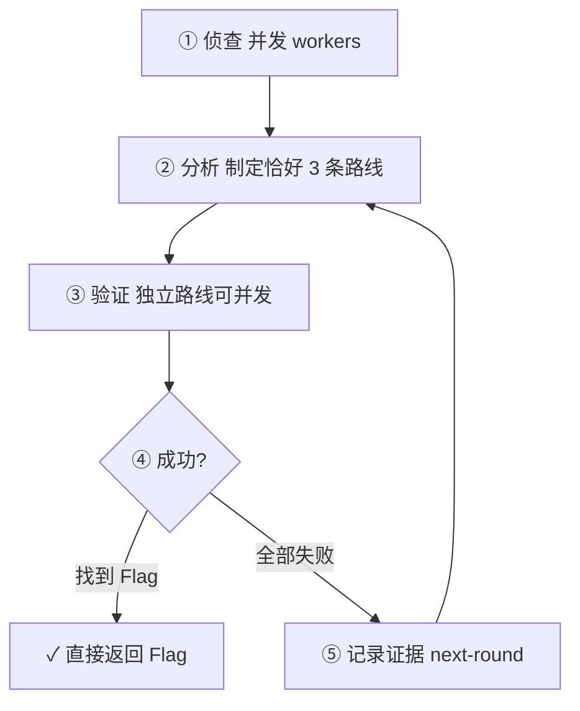

# Opencode for CTF

[English](./README_EN.md)

**opencode-for-ctf** 是一个面向 [OpenCode](https://opencode.ai) 的 CTF 自动化解题 Agent 插件。

它不是单一 prompt，而是一套围绕 **agents / commands / skills / tools** 组织的插件式 Agent 工程方案，为 CTF 解题提供结构化、可复用、可扩展的能力。

> **仅限授权场景。** 只用于你有权测试的 CTF、靶场、基准测试和本地实验。禁止对未授权目标使用。详见 [SECURITY.md](./SECURITY.md)。

## 默认用法

安装并重启 OpenCode 后，大多数情况只需要：

```text
/ctf ./challenge
```

`/ctf` 会先走内置 category 路由（工具 `ctf-route-plan`），再进入 `ctf-fast` 或 `ctf-expert` 解题流水线。family 只影响能力包与工具面，不是独立 primary agent。更多入口见 `/ctf-help`。

## 特性

- **单一默认入口** — `/ctf` 自动路由；需要时再强制 `/ctf-fast` / `/ctf-expert`
- **两大主 Agent** — `ctf-fast`（轻量快速）与 `ctf-expert`（证据驱动全面分析）
- **全题型覆盖** — Web / Pwn / Rev / Crypto / Forensics / Misc
- **140+ 工具** — 文件分析、Web 探测、二进制调试、密码学、取证等（L2 专家工具按需）
- **56+ 技能** — 各题型方法论沉淀为可复用 skill
- **命令分层** — L0 默认面极小；微命令保留给进阶场景
- **证据驱动** — `ctf-expert` 通过 **Evidence.md** 追踪已知信息，迭代逼近 flag
- **生产级 Team Mode** — `ctf-expert` 可并发调度 2–8 个隔离 worker
- **路径安全层** — 工作区边界、`CTF_ALLOWED_ROOTS`、敏感路径拒绝
- **可配置 hooks** — 可选 `opencode-for-ctf.jsonc` 关闭 hashline / continuation 等
- **Tool packs** — 默认不加载 android/godot；可用配置或环境变量打开
- **受管安装** — `npm run ctf:install` 部署到 OpenCode 配置目录，支持 upgrade / uninstall / doctor

## 要求

| 项目 | 版本 / 说明 |
| --- | --- |
| Node.js | `>= 22.20.0`（见 `package.json` engines） |
| OpenCode | 支持 plugin / agents / skills 的近期版本 |
| OS | Windows / Linux / macOS（部分 PWN/REV 工具依赖 WSL 或 Docker） |

## 快速开始

完整安装说明见 **[INSTALL.md](./INSTALL.md)**。下面是最短路径。

### 1. 源码安装（当前推荐）

```bash
git clone https://github.com/h1kibi/Opencode-for-CTF.git
cd Opencode-for-CTF
npm install
npm run check
npm run ctf:install
npm run ctf:status -- --strict
```

安装器会：

1. 构建自包含插件 bundle（`dist/plugin`）
2. 将 agents / commands / skills / rules / templates / knowledge / lessons 与插件复制到 OpenCode 配置目录
3. 以最小 JSONC 编辑合并进现有 `opencode.jsonc`（保留注释与用户配置）
4. 写 manifest（SHA-256），便于后续 upgrade / uninstall 且不覆盖用户改过的托管文件

默认 profile 为 **`safe`**（不写入可立即启用的 MCP）。重启 OpenCode 后执行：

```text
/ctf-help
/ctf ./challenge
```

### 2. 交给 LLM Agent 安装

把下面这段话原样发给 OpenCode / Claude Code / 其他编程 Agent：

> 请从 `https://github.com/h1kibi/Opencode-for-CTF.git` 克隆项目，阅读 `README.md`、`INSTALL.md` 与 `SECURITY.md`，确认 Node.js 满足 `>=22.20.0`，然后运行 `npm install`、`npm run check`、`npm run ctf:install` 和 `npm run ctf:status -- --strict`。使用默认 `safe` profile，不要启用任何 MCP，也不要修改我的 provider/model 配置。若安装或检查失败，停止并把准确错误返回给我；不要删除或覆盖我修改过的配置文件。

### 3. npm / CLI（registry 上线后）

```bash
npx opencode-for-ctf install
npx opencode-for-ctf status --strict
```

在包真正发布到 npm 之前，请使用源码目录下的 `npm run ctf:install`。CLI 与 `prepack` 已按发布形状准备好。

### 常用管理命令

```bash
npm run ctf:status      # 安装健康检查
npm run ctf:upgrade     # 升级托管文件（保留用户修改）
npm run ctf:uninstall   # 卸载托管安装
npm run doctor          # 安装 doctor
npm run ctf:help        # CLI 帮助
```

隔离配置目录做测试（PowerShell）：

```powershell
$env:XDG_CONFIG_HOME="$PWD\.tmp-xdg"
$env:OPENCODE_CONFIG_DIR="$env:XDG_CONFIG_HOME\opencode"
npm run ctf:install
npm run ctf:status -- --strict
```

Bash：

```bash
export XDG_CONFIG_HOME="$PWD/.tmp-xdg"
export OPENCODE_CONFIG_DIR="$XDG_CONFIG_HOME/opencode"
npm run ctf:install
npm run ctf:status -- --strict
```

## 可选配置

### 插件用户配置

复制 [`opencode-for-ctf.example.jsonc`](./opencode-for-ctf.example.jsonc) 为：

- 项目根目录：`opencode-for-ctf.jsonc`，或
- OpenCode 配置目录：`~/.config/opencode/opencode-for-ctf.jsonc`

可配置项包括：

| 字段 | 作用 |
| --- | --- |
| `default_mode` | `/ctf` 默认强度：`auto` \| `fast` \| `expert` |
| `disabled_hooks` | 关闭个别 runtime hooks |
| `hashline` / `continuation` / `team_mode` | 功能开关 |
| `tool_packs` / `expert_tool_packs` | 启动时注册的工具包 |
| `external_skills` | 是否纳入外部 skills 路径 |

### 工作区配置

参考 [`CTF_WORKSPACE_OPENCODE_TEMPLATE.jsonc`](./CTF_WORKSPACE_OPENCODE_TEMPLATE.jsonc)，复制到 CTF 工作区后从该目录启动 OpenCode。

### 环境变量（按需）

| 变量 | 用途 |
| --- | --- |
| `DEEPSEEK_API_KEY` | DeepSeek API Key |
| `GITHUB_PAT` | GitHub Personal Access Token（只读即可） |
| `GHIDRA_INSTALL_DIR` | Ghidra 安装目录 |
| `JINA_API_KEY` / `BRAVE_API_KEY` 等 | 搜索 / 抓取类 MCP |
| `CTF_ALLOWED_ROOTS` | 额外允许的文件根（Windows `;`，Unix `:`） |
| `CTF_ALLOWED_HOSTS` | 额外允许的 Web 探测主机 |
| `OPENCODE_CTF_TOOL_PACKS` | 覆盖 tool packs，如 `all` 或 `core,web,pwn` |
| `OPENCODE_CONFIG_DIR` | 覆盖 OpenCode 配置目录 |
| `OPENCODE_CTF_INCLUDE_EXTERNAL_SKILLS=1` | 安装时复制外部 ctf-skills（体积大） |

完整 `.env` 模板见 [`.env.example`](./.env.example)。**不要提交真实密钥。**

### 外部 skills

`npm install` **不会**自动联网拉取；默认 npm 包也不包含 `skills-external/` 或历史 pattern-card 版本（仅 `v9` 运行时索引）。源码检出若需要 `ljagiello/ctf-skills` 快照：

```bash
npm run fetch-skills
```

许可与归属见 [`third_party/NOTICE.md`](./third_party/NOTICE.md)。更多瘦包说明见 [INSTALL.md](./INSTALL.md#slim-package-contents)。

## 手动配置（不推荐）

若不想用受管安装器，可在 `~/.config/opencode/opencode.jsonc` 中自行引用源码路径。请把路径换成你本机的绝对路径：

```jsonc
{
  "plugin": ["file:/absolute/path/to/Opencode-for-CTF"],
  "default_agent": "ctf-fast",
  "skills": {
    "paths": [
      "/absolute/path/to/Opencode-for-CTF/skills"
    ]
  },
  "instructions": [
    "/absolute/path/to/Opencode-for-CTF/rules/zh-rules.md",
    "/absolute/path/to/Opencode-for-CTF/rules/en-solve-rules.md"
  ]
}
```

> 手动模式没有 manifest / upgrade / 安全卸载。优先使用 `npm run ctf:install`。

旧版 `npm run setup`（由 `.env` 生成 `opencode.json`）仅作兼容保留。

## Agent 一览

| Agent | 类型 | 用途 |
| --- | --- | --- |
| `ctf-fast` | **主 agent** | 轻量快速解题 — 直觉优先、最小工具依赖 |
| `ctf-expert` | **主 agent** | 证据驱动 — 侦查→分析→路线验证→迭代 |
| `researcher` | 支持主 agent | 本地知识库维护（非 CTF 解题车道） |
| `ctf-web` / `ctf-pwn` / `ctf-rev` / `ctf-crypto` / `ctf-forensics` | 子 agent | 题型 playbook / family overlay |
| `ctf-scout` / `ctf-librarian` / `ctf-oracle` | 子 agent | 侦察 / 知识库 / 模式推断 |

### 选择指南

| 场景 | 推荐入口 |
| --- | --- |
| 默认、不确定题型 | `/ctf` |
| 快速尝试、简单题 | `/ctf-fast` |
| 复杂逆向 / 二进制利用 | `/ctf-expert` |
| 多步骤 Web 链 | `/ctf-expert` |
| 多次尝试仍未解出 | `/ctf-expert` |

## 使用方式

```text
/ctf ./challenge
/ctf-help
/ctf-fast ./challenge
/ctf-expert ./challenge
/ctf-web http://127.0.0.1:8000
/ctf-pwn ./chall --remote 127.0.0.1:31337
/ctf-rev ./crackme
/ctf-crypto ./challenge.py
/ctf-forensics ./artifact.pcap
```

> `/ctf-solve` 仅为历史兼容命令别名。新产品路径请使用 `/ctf`；主 agent 只有 `ctf-fast` / `ctf-expert`。

### ctf-expert 工作流

`ctf-expert` 是 Team Mode 编排者：并发调度 subagent，自己维护策略与 **Evidence.md**（工具 `ctf-evidence-board`）。



- 路线四态：`untested` | `blocked` | `dead` | `live`（**blocked ≠ dead**）
- 拿到 flag **直接返回**，不强制写 flag 文件
- 动态 MCP：subagent `ctf-dynamic-mcp-advisor request` → expert `ctf-mcp-control approve/deny`
- `ctf-fast` 仅轻量工具白名单；难题请 `/ctf-expert`

### Team Mode

`ctf-expert` 是唯一允许控制并发 Team Mode 的 Agent：

- `ctf-team-dispatch` — 启动 2–8 个独立子会话
- `ctf-team-status` / `ctf-team-collect` / `ctf-team-cancel` / `ctf-team-close` / `ctf-team-recover`

worker 只返回证据，不应直接写 `notes.md`、`.ctf-state.json`、`.ctf-team.json` 或 `agent_flag.txt`；其中 `notes.md` 仅作迁移/导出，不是 canonical state。

## 仓库结构

```text
Opencode-for-CTF/
├── INSTALL.md             # 安装与升级指南
├── LICENSE                # MIT
├── SECURITY.md            # 安全策略与授权范围
├── CHANGELOG.md
├── CONTRIBUTING.md
├── opencode-for-ctf.example.jsonc
├── CTF_WORKSPACE_OPENCODE_TEMPLATE.jsonc
├── agents/                # Agent 定义
├── commands/              # Slash 命令
├── skills/                # CTF 技能
├── tools/                 # 工具定义
├── src/                   # 插件运行时
├── packages/              # ctf-core / adapter 等
├── scripts/               # install / CLI / release-check
├── rules/                 # 安全与解题规则
├── knowledge/             # lessons / pattern-cards
├── docker/                # pwn/rev 多架构镜像
├── runtime/               # 运行时辅助
└── test/                  # Vitest
```

## 开发与发布检查

```bash
npm install
npm run check          # tsc + content validate + vitest
npm run build:plugin
npm run release:check
# 或
npm run pack:check     # build + release-check + npm pack --dry-run
```

公开前自检清单见 [RELEASE_CHECKLIST.md](./RELEASE_CHECKLIST.md)。贡献流程见 [CONTRIBUTING.md](./CONTRIBUTING.md)。路线图见 [ROADMAP.md](./ROADMAP.md)。

## 安全边界

- 本配置**不是**完整沙箱。未知二进制、恶意文档和可疑样本必须在隔离环境中运行。
- 本地文件工具默认只能访问当前项目、OpenCode worktree 和 `CTF_ALLOWED_ROOTS`。
- `.env`、SSH/GPG、私钥以及云凭据路径会被拒绝。
- 私网 / 链路本地 Web 目标必须显式加入 `CTF_ALLOWED_HOSTS`，且仍须在授权范围内。
- 所有 MCP 默认禁用；检查命令、路径、权限和数据流向后再启用。
- 漏洞请按 [SECURITY.md](./SECURITY.md) 私下报告，不要公开提 issue。

## 第三方

外部 skill 与衍生 pattern 的归属见 [`third_party/NOTICE.md`](./third_party/NOTICE.md)。

## License

[MIT](./LICENSE)
