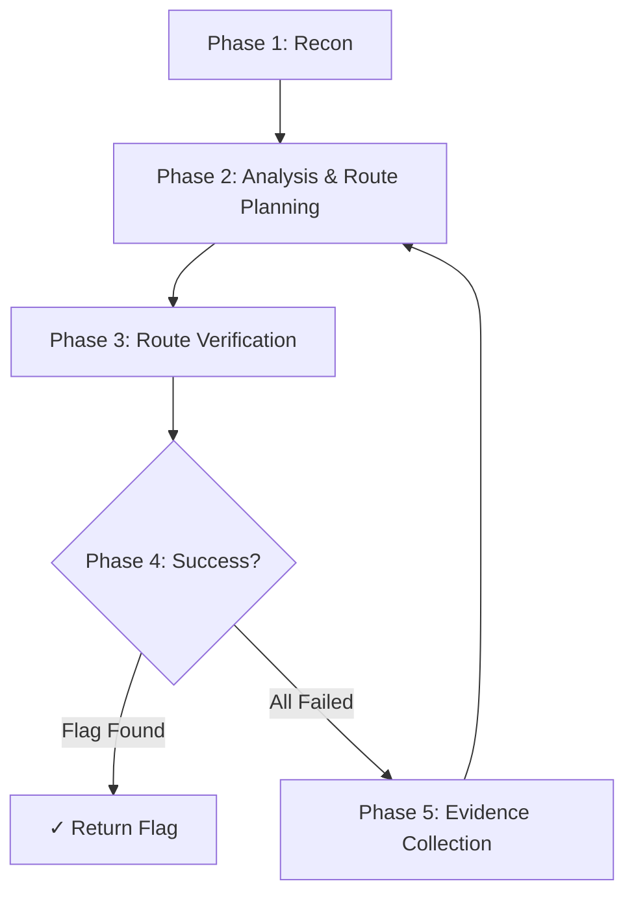

# Opencode for CTF

[简体中文](./README.md)

**opencode-for-ctf** is an [OpenCode](https://opencode.ai) plugin for automated CTF challenge solving.

This is not a single prompt or a loose collection of scripts. It is a complete plugin-based agent engineering solution, organized around **agents / commands / skills / tools**, providing structured, reusable, and extensible CTF solving capabilities.

## Features

- **Two Primary Agents** — `ctf-fast` (lightweight fast solving) and `ctf-expert` (evidence-driven comprehensive solving)
- **Full Category Coverage** — Web / Pwn / Rev / Crypto / Forensics / Misc
- **140+ Tools** — File analysis, Web probing, binary debugging, crypto computation, forensic extraction
- **56+ Skills** — Domain-specific methodologies packaged as reusable skills
- **120+ Commands** — Unified entry points, reducing manual context organization
- **Evidence-Driven** — `ctf-expert` mode tracks known info via Evidence.md, iteratively approaching the flag
- **Plugin Architecture** — Loads as an OpenCode plugin, non-intrusive

## Quick Start

### Install as Plugin

Add the plugin reference in `~/.config/opencode/opencode.jsonc`:

```jsonc
{
  "plugin": ["file:C:\\path\\to\\Opencode-for-CTF"],
  "default_agent": "ctf-fast",  // or ctf-expert
  "skills": {
    "paths": [
      "C:\\path\\to\\Opencode-for-CTF\\skills",
      "C:\\path\\to\\Opencode-for-CTF\\skills-external\\ctf-skills"
    ]
  },
  "instructions": [
    "C:\\path\\to\\Opencode-for-CTF\\rules-cn.md",
    "C:\\path\\to\\Opencode-for-CTF\\ctf-rules.md"
  ]
}
```

### Install Dependencies

```bash
npm install
```

## Agent Overview

| Agent | Type | Purpose |
|-------|------|---------|
| `ctf-fast` | **Primary** | Lightweight fast solving — intuition-first, minimal tooling |
| `ctf-expert` | **Primary** | Evidence-driven solving — recon → analyze → verify → iterate |
| `ctf-web` | Subagent | Web exploitation |
| `ctf-pwn` | Subagent | Binary exploitation |
| `ctf-rev` | Subagent | Reverse engineering |
| `ctf-crypto` | Subagent | Cryptography attacks |
| `ctf-forensics` | Subagent | Forensics analysis |
| `ctf-scout` | Subagent | Information gathering |
| `ctf-librarian` | Subagent | Knowledge base query |
| `ctf-oracle` | Subagent | Pattern matching & inference |

### Selection Guide

| Scenario | Recommended Agent |
|----------|------------------|
| Quick attempts, simple challenges | `ctf-fast` |
| Known patterns, quick validation | `ctf-fast` |
| Complex reversing/binary exploitation | `ctf-expert` |
| Multi-step Web exploitation chains | `ctf-expert` |
| Unfamiliar challenge types | `ctf-expert` |
| Stuck after multiple attempts | `ctf-expert` |

## Repository Structure

```
Opencode-for-CTF/
├── opencode.json           # Plugin entry point
├── package.json            # Node.js dependencies
├── agents/                 # Agent definitions (YAML frontmatter + markdown)
├── commands/               # Slash commands
├── skills/                 # CTF skill library (56+ skills)
├── skills-external/        # External CTF skills (ctf-skills mirror)
├── tools/                  # CTF tools (140+ tools)
├── templates/              # solve / exploit templates
├── src/                    # Plugin runtime
│   ├── plugin.ts           # Plugin entry
│   ├── team-manager.ts     # Team mode orchestration
│   └── continuation-manager.ts
├── scripts/                # Validation & diagnostic scripts
├── rules/                  # Safety / CTF rules
├── knowledge/              # Knowledge base (lessons, pattern-cards)
├── lessons/                # Structured lessons
├── packages/               # Sub-packages (ctf-core, ctf-notes-core, etc.)
└── runtime/                # Runtime environment scripts
```

## Configuration

### Workspace Config

See `CTF_WORKSPACE_OPENCODE_TEMPLATE.jsonc` for workspace configuration reference.

### Environment Variables

| Variable | Purpose |
|----------|---------|
| `DEEPSEEK_API_KEY` | DeepSeek API Key |
| `GITHUB_PAT` | GitHub Personal Access Token |
| `GHIDRA_INSTALL_DIR` | Ghidra installation directory |
| `JINA_API_KEY` | Jina AI API Key |
| `BRAVE_API_KEY` | Brave Search API Key |

## Usage

### Fast Solving (ctf-fast)

For simple to medium challenges, intuition-first, quick validation:

```
/ctf-fast ./challenge
```

### Comprehensive Solving (ctf-expert)

For complex challenges, evidence-driven, iterative:

```
/ctf-expert ./challenge
```

### Specialist Subagents

For known challenge types, call the corresponding subagent directly:

```
/ctf-web http://127.0.0.1:8000
/ctf-pwn ./chall --remote 127.0.0.1:31337
/ctf-rev ./crackme
/ctf-crypto ./challenge.py
/ctf-forensics ./artifact.pcap
```

### ctf-expert Workflow

`ctf-expert` follows a five-phase iterative loop:



- Plans **3 routes** per round, verifies sequentially
- Maintains `Evidence.md` tracking known info and verified facts
- Blocked ≠ dead end; WAF/obstacles may indicate correct direction
- On 3-route failure, collects evidence, re-analyzes, iterates until flag

## Agent Development

This plugin follows the OpenCode Agent specification. Agents are defined using YAML frontmatter + markdown:

```yaml
---
"description": "Agent description"
"mode": "primary"  # or subagent
"temperature": 0
"steps": 120
---
# Agent instructions
```

See [AGENTS.md](./AGENTS.md) for details.

## License

MIT
