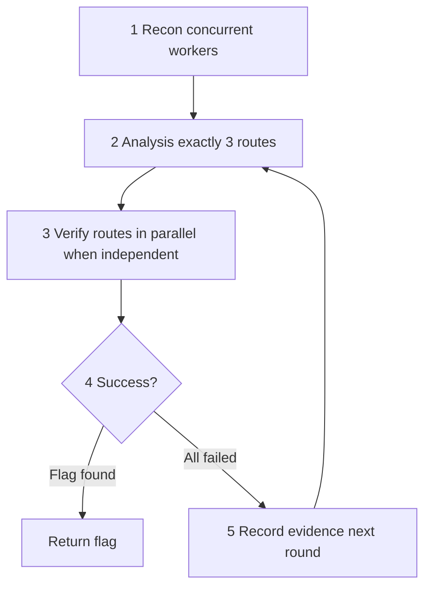

# Opencode for CTF

[简体中文](./README.md)

**opencode-for-ctf** is an [OpenCode](https://opencode.ai) plugin for automated CTF challenge solving.

This is not a single prompt. It is a plugin-based agent system organized around **agents / commands / skills / tools**, providing structured, reusable CTF solving workflows.

> **Authorized use only.** Use this project only on CTF competitions, labs, benchmarks, and local environments you are allowed to test. Do not target unauthorized systems. See [SECURITY.md](./SECURITY.md).

## Default usage

After install and restarting OpenCode, most users only need:

```text
/ctf ./challenge
```

`/ctf` runs the built-in category router (`ctf-route-plan`) and then solves on the fast or expert lane. See `/ctf-help`.

## Features

- **Single default entry** — `/ctf` auto-routes; force `/ctf-fast` / `/ctf-expert` when needed
- **Two primary agents** — `ctf-fast` (lightweight) and `ctf-expert` (evidence-driven)
- **Full category coverage** — Web / Pwn / Rev / Crypto / Forensics / Misc
- **140+ tools** — file analysis, web probing, binary debugging, crypto, forensics
- **56+ skills** — reusable methodology packs
- **Layered commands** — tiny L0 surface; advanced micro-commands stay available
- **Evidence-driven** — `ctf-expert` tracks known facts via **Evidence.md**
- **Production Team Mode** — 2–8 isolated workers with collect / cancel / recover
- **Path security** — workspace bounds, `CTF_ALLOWED_ROOTS`, sensitive-path rejection
- **Configurable hooks** — optional `opencode-for-ctf.jsonc`
- **Tool packs** — defaults omit rare packs (android/godot)
- **Managed install** — `npm run ctf:install` with upgrade / uninstall / doctor

## Requirements

| Item | Requirement |
| --- | --- |
| Node.js | `>= 22.20.0` |
| OpenCode | Recent build with plugins / agents / skills |
| OS | Windows / Linux / macOS (some pwn/rev tooling needs WSL or Docker) |

## Quick start

Full install guide: **[INSTALL.md](./INSTALL.md)**.

### 1. Source install (recommended today)

```bash
git clone https://github.com/h1kibi/Opencode-for-CTF.git
cd Opencode-for-CTF
npm install
npm run check
npm run ctf:install
npm run ctf:status -- --strict
```

The installer:

1. Builds the self-contained plugin bundle (`dist/plugin`)
2. Copies agents / commands / skills / rules / templates / knowledge / lessons + plugin into the OpenCode config directory
3. Merges paths into existing JSONC with minimal edits (comments preserved)
4. Writes a SHA-256 manifest so upgrades/uninstalls do not clobber later user edits

Default profile is **`safe`** (no immediately enabled MCP). Restart OpenCode, then:

```text
/ctf-help
/ctf ./challenge
```

### 2. Install with an LLM agent

Paste this prompt into OpenCode, Claude Code, or another coding agent:

> Clone `https://github.com/h1kibi/Opencode-for-CTF.git`, read `README_EN.md`, `INSTALL.md`, and `SECURITY.md`, verify Node.js is `>=22.20.0`, then run `npm install`, `npm run check`, `npm run ctf:install`, and `npm run ctf:status -- --strict`. Use the default `safe` profile. Do not enable any MCP server and do not replace my provider/model configuration. If installation or validation fails, stop and report the exact error; do not delete or overwrite configuration files I have modified.

### 3. npm / CLI (after registry publish)

```bash
npx opencode-for-ctf install
npx opencode-for-ctf status --strict
```

Until the package is published, use `npm run ctf:install` from a source checkout. The CLI and `prepack` flow are already shaped for npm.

### Management commands

```bash
npm run ctf:status
npm run ctf:upgrade
npm run ctf:uninstall
npm run doctor
npm run ctf:help
```

Isolated config test (PowerShell):

```powershell
$env:XDG_CONFIG_HOME="$PWD\.tmp-xdg"
$env:OPENCODE_CONFIG_DIR="$env:XDG_CONFIG_HOME\opencode"
npm run ctf:install
npm run ctf:status -- --strict
```

Bash:

```bash
export XDG_CONFIG_HOME="$PWD/.tmp-xdg"
export OPENCODE_CONFIG_DIR="$XDG_CONFIG_HOME/opencode"
npm run ctf:install
npm run ctf:status -- --strict
```

## Optional configuration

### Plugin user config

Copy [`opencode-for-ctf.example.jsonc`](./opencode-for-ctf.example.jsonc) to:

- project root: `opencode-for-ctf.jsonc`, or
- OpenCode config dir: `~/.config/opencode/opencode-for-ctf.jsonc`

| Field | Purpose |
| --- | --- |
| `default_mode` | `/ctf` intensity: `auto` \| `fast` \| `expert` |
| `disabled_hooks` | Disable individual runtime hooks |
| `hashline` / `continuation` / `team_mode` | Feature toggles |
| `tool_packs` / `expert_tool_packs` | Packs registered at startup |
| `external_skills` | Include external skill paths |

### Workspace config

See [`CTF_WORKSPACE_OPENCODE_TEMPLATE.jsonc`](./CTF_WORKSPACE_OPENCODE_TEMPLATE.jsonc). Copy into your CTF workspace and start OpenCode from that directory.

### Environment variables

| Variable | Purpose |
| --- | --- |
| `DEEPSEEK_API_KEY` | DeepSeek API key |
| `GITHUB_PAT` | GitHub personal access token (read-only is enough) |
| `GHIDRA_INSTALL_DIR` | Ghidra install directory |
| `JINA_API_KEY` / `BRAVE_API_KEY` … | Search / scrape MCP providers |
| `CTF_ALLOWED_ROOTS` | Extra file roots (`;` on Windows, `:` on Unix) |
| `CTF_ALLOWED_HOSTS` | Extra hosts for web probes |
| `OPENCODE_CTF_TOOL_PACKS` | Override packs, e.g. `all` or `core,web,pwn` |
| `OPENCODE_CONFIG_DIR` | Override OpenCode config directory |
| `OPENCODE_CTF_INCLUDE_EXTERNAL_SKILLS=1` | Copy external ctf-skills on install (large) |

Full template: [`.env.example`](./.env.example). **Never commit real secrets.**

### External skills

`npm install` does **not** network-fetch skills. The default npm package also omits `skills-external/` and intermediate pattern-card dumps (runtime keeps the `v9` index only). For a local `ljagiello/ctf-skills` snapshot from a source checkout:

```bash
npm run fetch-skills
```

Attribution: [`third_party/NOTICE.md`](./third_party/NOTICE.md). See [INSTALL.md](./INSTALL.md#slim-package-contents) for the slim-pack rules.

## Manual setup (not recommended)

You can point OpenCode at a source checkout yourself. Replace paths with absolute paths on your machine:

```jsonc
{
  "plugin": ["file:/absolute/path/to/Opencode-for-CTF"],
  "default_agent": "ctf-fast",
  "skills": {
    "paths": [
      "/absolute/path/to/Opencode-for-CTF/skills"
    ]
  },
  "instructions": [
    "/absolute/path/to/Opencode-for-CTF/rules/zh-rules.md",
    "/absolute/path/to/Opencode-for-CTF/rules/en-solve-rules.md"
  ]
}
```

Manual mode has no manifest / upgrade / safe uninstall. Prefer `npm run ctf:install`.

Legacy `npm run setup` (generates `opencode.json` from `.env`) remains for compatibility only.

## Agents

| Agent | Type | Purpose |
| --- | --- | --- |
| `ctf-fast` | **Primary** | Lightweight, intuition-first solving |
| `ctf-expert` | **Primary** | Evidence-driven recon → plan → verify → iterate |
| `ctf-master` | Compatibility | Alias of `ctf-expert` — not a third mode |
| Category specialists | Subagents | `ctf-web`, `ctf-pwn`, `ctf-rev`, `ctf-crypto`, `ctf-forensics` |
| Support | Subagents | `ctf-scout`, `ctf-librarian`, `ctf-oracle` |

### Selection guide

| Scenario | Entry |
| --- | --- |
| Default / unclear category | `/ctf` |
| Quick / simple challenges | `/ctf-fast` |
| Complex reverse / binary exploitation | `/ctf-expert` |
| Multi-step web chains | `/ctf-expert` |
| Stuck after several attempts | `/ctf-expert` |

## Usage

```text
/ctf ./challenge
/ctf-help
/ctf-fast ./challenge
/ctf-expert ./challenge
/ctf-web http://127.0.0.1:8000
/ctf-pwn ./chall --remote 127.0.0.1:31337
/ctf-rev ./crackme
/ctf-crypto ./challenge.py
/ctf-forensics ./artifact.pcap
```

> `/ctf-master` and `/ctf-solve` are compatibility aliases. Prefer `/ctf`.

### ctf-expert workflow



- Route states: `untested` | `blocked` | `dead` | `live` (**blocked ≠ dead**)
- Return the flag directly when found
- Heavy MCP: subagent requests via `ctf-dynamic-mcp-advisor` → expert `ctf-mcp-control` approve/deny
- `ctf-fast` uses a lightweight tool allowlist

### Team Mode

Only `ctf-expert` may control concurrent Team Mode (`ctf-team-dispatch`, status/collect/cancel/close/recover). Workers return evidence only; they should not write `notes.md`, `.ctf-state.json`, `.ctf-team.json`, or `agent_flag.txt`.

## Repository layout

```text
Opencode-for-CTF/
├── INSTALL.md
├── LICENSE
├── SECURITY.md
├── agents/
├── commands/
├── skills/
├── tools/
├── src/
├── packages/
├── scripts/
├── rules/
├── knowledge/
├── docker/
├── runtime/
└── test/
```

## Development / release checks

```bash
npm install
npm run check
npm run build:plugin
npm run release:check
# or
npm run pack:check
```

Pre-publish checklist: [RELEASE_CHECKLIST.md](./RELEASE_CHECKLIST.md). See also [CONTRIBUTING.md](./CONTRIBUTING.md) and [ROADMAP.md](./ROADMAP.md).

## Safety boundary

- This is **not** a full sandbox. Isolate unknown binaries and suspicious samples.
- Local file tools stay inside the project, OpenCode worktree, and `CTF_ALLOWED_ROOTS`.
- `.env`, SSH/GPG, private keys, and cloud credential paths are rejected.
- Private / link-local web targets need explicit `CTF_ALLOWED_HOSTS` and must still be authorized.
- MCP servers stay disabled by default.
- Report vulnerabilities privately per [SECURITY.md](./SECURITY.md).

## Third-party

Attribution for external skills and derived pattern cards: [`third_party/NOTICE.md`](./third_party/NOTICE.md).

## License

[MIT](./LICENSE)
